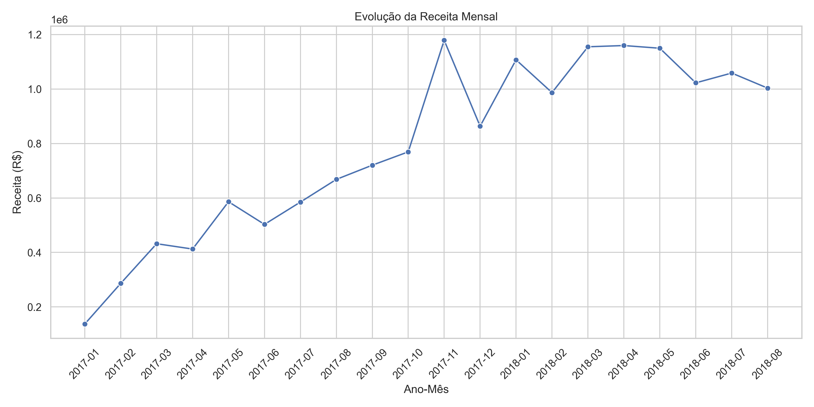
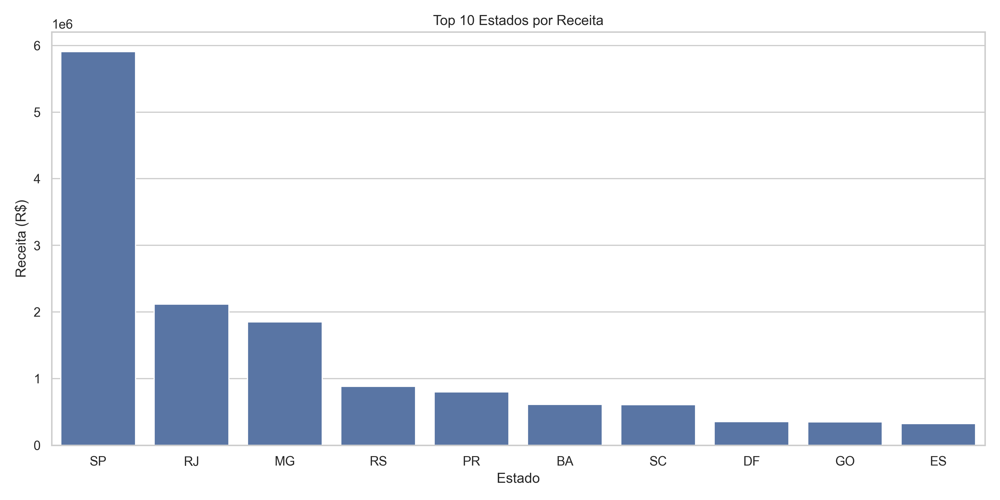
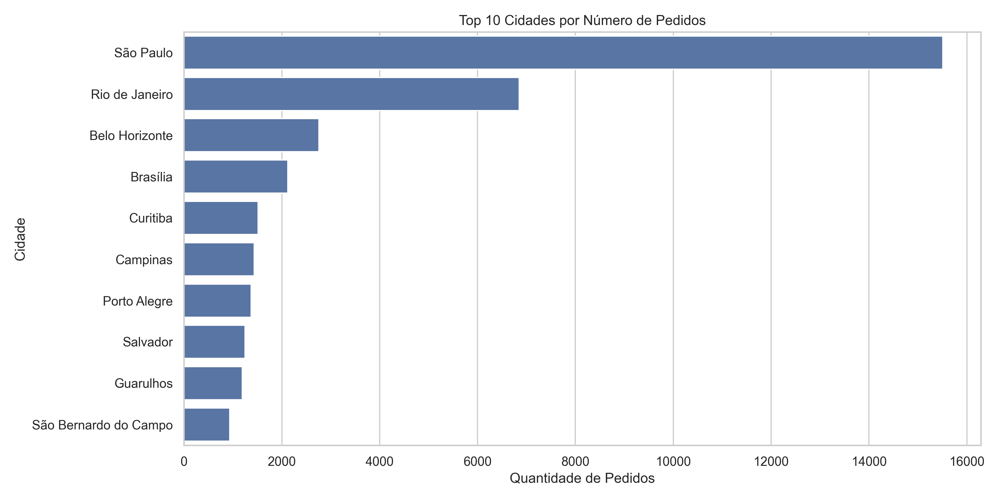
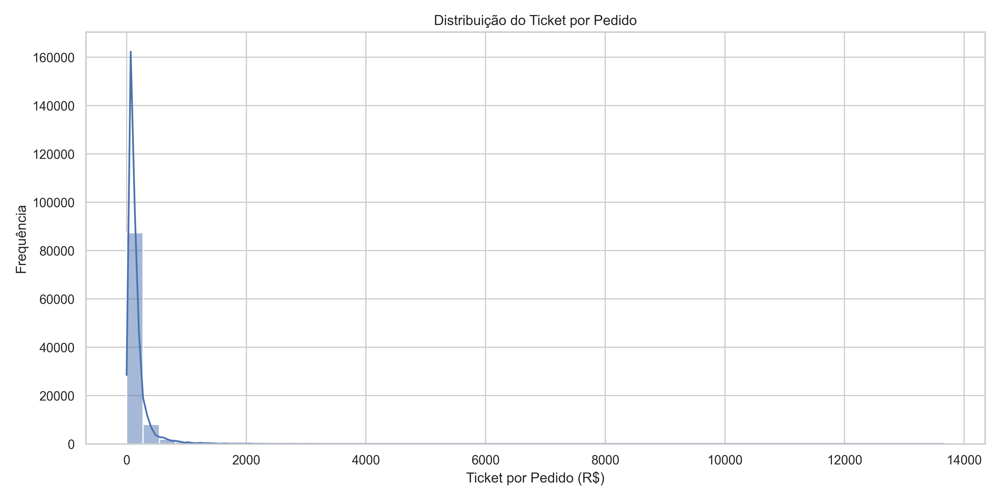
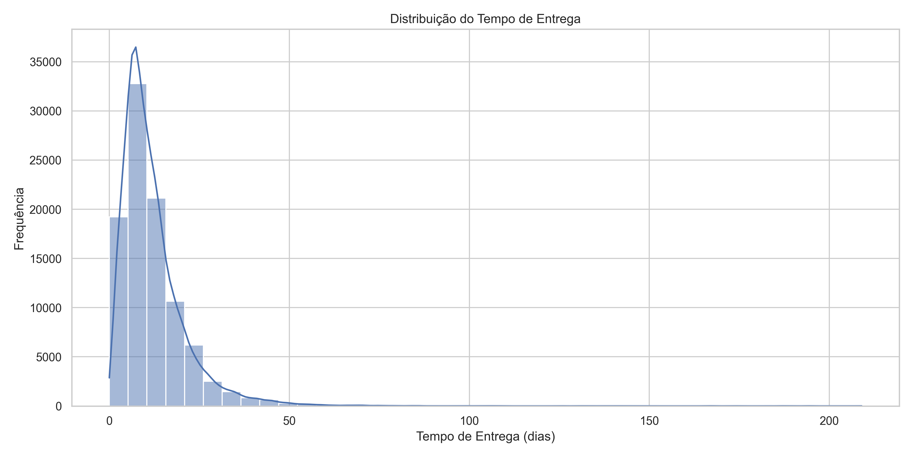
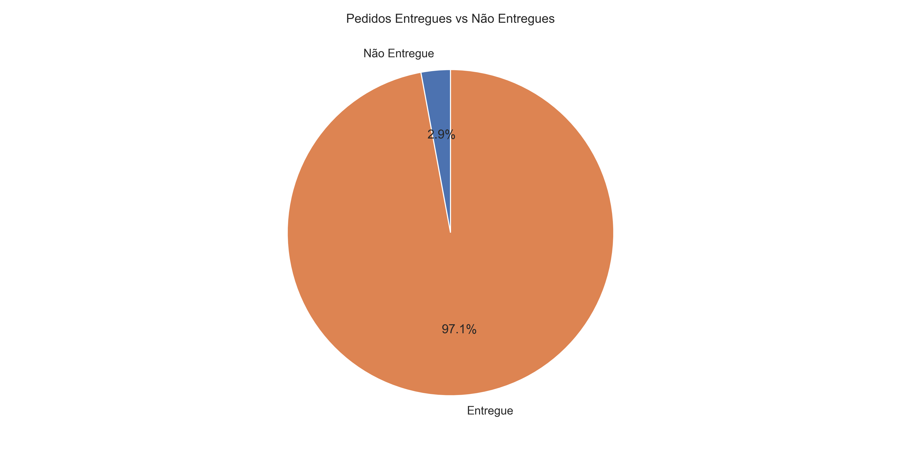
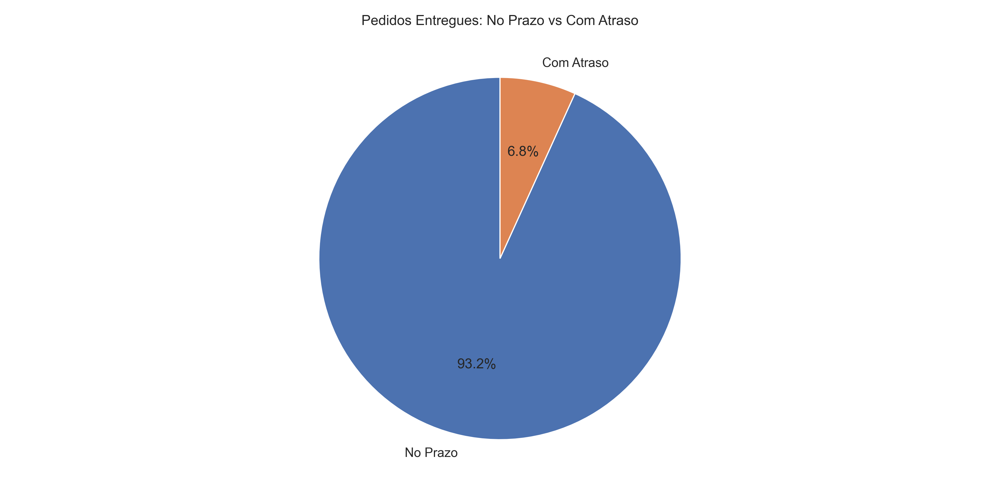
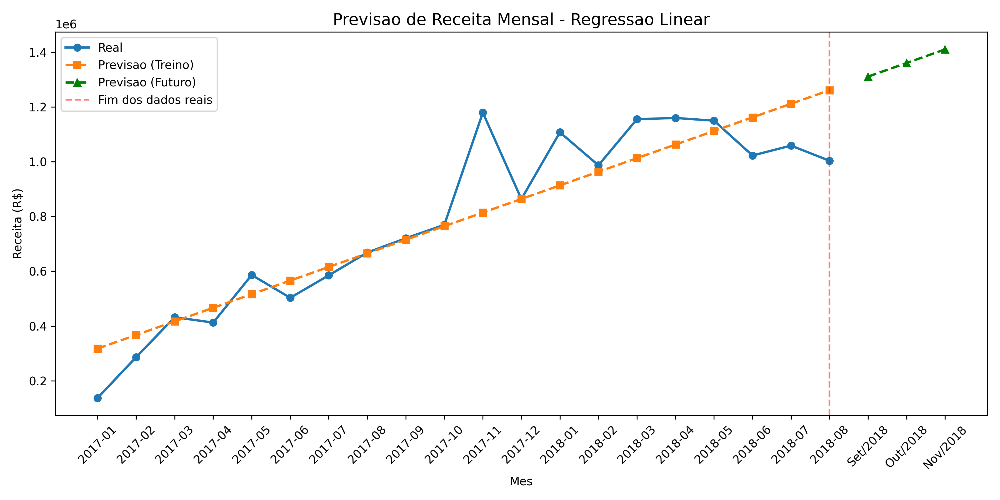
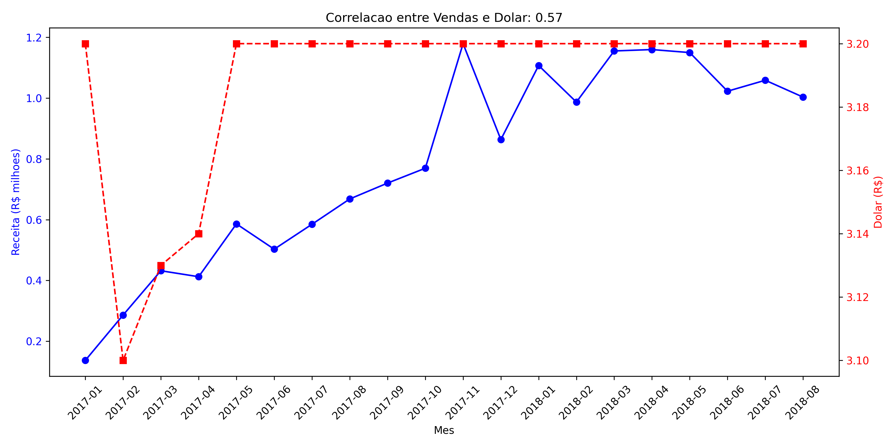

# 🚀 Projeto Olist - Análise de Dados Completa

## 📋 Sobre o Projeto
Análise completa dos dados da Olist (marketplace brasileiro) utilizando Python, SQL, PostgreSQL, Power BI, Machine Learning, API REST e Docker.

**Período analisado:** Janeiro/2017 a Agosto/2018  
**Total de pedidos:** 99.092  
**Receita total:** R$ 15.786.204

Os dados consideram o período **consistente de Janeiro/2017 a Agosto/2018**, removendo meses parciais de 2016 (início das operações da Olist) e dados futuros sem vendas.

**Motivo:** Os meses de 2016 apresentam dados parciais (outubro com apenas 10 dias de vendas, dezembro com R$ 19,62), e os meses de setembro/outubro de 2018 contêm apenas pedidos cancelados, o que distorceria análises de crescimento e sazonalidade.

Todas as análises (Python, SQL, Power BI) utilizam **o mesmo período** para garantir consistência entre as ferramentas.

---

## 🌐 API em Produção (Online)

A API está hospedada no Render e pode ser acessada de qualquer lugar:

| Link | URL |
|------|-----|
| **Documentação Interativa (Swagger)** | [https://projeto-olist-portfolio.onrender.com/docs](https://projeto-olist-portfolio.onrender.com/docs) |
| **Base da API** | [https://projeto-olist-portfolio.onrender.com](https://projeto-olist-portfolio.onrender.com) |

### Endpoints disponíveis:

| Endpoint | URL | Retorna |
|----------|-----|---------|
| KPIs Gerais | `/kpis` | Receita total, pedidos, ticket médio |
| Receita por estado | `/receita/estado` | Faturamento por UF (SP, RJ, MG...) |
| Receita mensal | `/receita/mensal` | Evolução mês a mês |
| Insights | `/insights` | Pedidos críticos e taxa de atraso |
| Impacto do frete | `/frete/impacto` | Estados com maior percentual de frete |
| Impacto do atraso | `/atraso/impacto` | Estados com maior taxa de atraso |

### Exemplo de resposta da API:

```json
{
  "receita_total": "R$ 15.786.203,57",
  "total_pedidos": "99.092",
  "ticket_medio": "R$ 159,31"
}
```

📊 Definição de Métricas
Pedidos Críticos
São pedidos que atendem a ambas as condições:
Valor do pedido < R$ 100
Frete > 30% do valor do pedido

Exemplo: Um produto de R$ 50 com frete de R$ 20 (40% do valor) é considerado crítico.
Resultado: 17,28% dos pedidos (≈17.180 pedidos) se enquadram como críticos.
Recomendação: Revisar política de frete para produtos de baixo valor.

Taxa de Atraso
Percentual de pedidos entregues com atraso em relação ao total de pedidos entregues.
Resultado: 6,79% dos pedidos entregues tiveram atraso.

Ticket Médio
Valor médio gasto por pedido (produto + frete).
Resultado: R$ 159,31 por pedido.

🛠️ Tecnologias Utilizadas
Tecnologia	      Aplicação
Python	          ETL, limpeza, transformação, Machine Learning, Web Scraping
SQL	              Consultas analíticas, validação de dados, Views, Procedures
PostgreSQL	      Banco de dados relacional
Power BI	        Dashboards interativos
FastAPI	          API REST para consulta de resultados
Render	          Deploy da API na nuvem
Docker	          Containerização da aplicação
Git	              Versionamento

📊 Principais Análises e Resultados
KPIs Gerais
Indicador	              Valor
Receita Total	          R$ 15.786.204
Total de Pedidos	      99.092
Ticket Médio	          R$ 159,31
Taxa de Atraso	        6,79%
Pedidos Críticos*	      17,28%
*Pedidos com valor < R$100 e frete > 30% do produto

Insights de Negócio
📍 Concentração Geográfica
SP concentra 37,38% da receita total
Top 5 estados representam 73,18% da receita

🚚 Impacto do Frete
RR tem o maior peso de frete: 21,73% do valor do produto
17,28% dos pedidos são críticos (frete alto + ticket baixo)

⏰ Logística
AL tem a maior taxa de atraso: 21,46%
Estados do Norte/Nordeste têm maior tempo de entrega (até 28 dias)

📈 Machine Learning - Previsão de Vendas
Modelo: Regressão Linear
Acurácia (R²): 81,85%

Previsões para 2018:
Setembro: R$ 1.310.831,47
Outubro: R$ 1.360.500,17
Novembro: R$ 1.410.168,86

💰 Correlação Econômica
Correlação Dólar vs Vendas: 0,57 (positiva moderada)
Conclusão: Quando dólar sobe, vendas também sobem

## 📈 Visualizações e Gráficos

### Evolução da Receita Mensal


### Top Estados por Receita


### Top Cidades por Pedidos


### Distribuição do Ticket por Pedido


### Distribuição do Tempo de Entrega


### Entregues vs Não Entregues


### Atraso vs Prazo Estimado


### Previsão de Vendas (Machine Learning)


### Correlação Dólar vs Vendas


📁 Estrutura do Projeto

projeto_olist_portfolio/
├── dados_brutos/          # Arquivos CSV originais
├── dados_tratados/        # Dados após limpeza e transformação
├── notebooks/             # Scripts Python (01 a 10)
├── queries_sql/           # 18 queries analíticas + Views + Procedures
├── power_bi/              # Dashboard .pbix
├── prints_sql/            # Prints dos resultados SQL
├── prints_api/            # Prints dos endpoints da API
├── prints_powerbi/        # Prints do dashboard
├── graficos/              # Gráficos gerados pelo Python
├── Dockerfile             # Configuração do container Docker
├── docker-compose.yml     # Orquestração Docker
└── README.md              # Documentação

🐍 Scripts Python

Script	                            Função
01_carregamento_e_inspecao.py	      Carrega e inspeciona os dados
02_limpeza_e_transformacao.py	      Limpeza, transformação e métricas
03_analise_inicial_kpis.py	        Cálculo de KPIs básicos
04_eda_visual.py	                  Análise exploratória e gráficos
05_modelagem_portfolio.py         	Modelagem Star Schema
06_analise_negocio_insights.py	    Insights e recomendações
07_carga_postgresql.py	            Carga no PostgreSQL
08_previsao_vendas.py	              Machine Learning (Regressão Linear)
09_web_scraping.py	                Coleta de cotação do dólar
10_api_resultados.py	              API REST com FastAPI

🗄️ SQL - Queries Analíticas
Foram desenvolvidas 18 queries cobrindo:
KPIs gerais (receita, pedidos, ticket médio)
Evolução mensal e acumulada
Variação mês a mês (MoM)
Top 10 estados, cidades, categorias
Taxa de atraso por estado
Peso do frete por estado
Pedidos críticos
Dashboard executivo em SQL

Views e Procedures
Foram criadas 4 views e 3 procedures para automação e reutilização de consultas:
vw_resumo_vendas_estado: Resumo de vendas por estado
vw_resumo_vendas_mensal: Evolução mensal com variação
vw_pedidos_criticos: Identificação de pedidos com frete alto
vw_performance_entregas: Análise de atrasos por estado

📊 Power BI Dashboard
Página 1 - Executive Dashboard
5 cartões de KPI
Evolução da receita mensal
Top 10 estados e cidades por receita
Ranking de atraso e frete por estado

Página 2 - Análise Estratégica
Tempo médio de entrega por estado
Previsão de vendas com Machine Learning
Correlação dólar vs vendas
Pedidos por dia da semana

🔌 API REST
A API permite consultar os resultados em tempo real.

Como testar localmente:
python notebooks/10_api_resultados.py
# Acesse http://localhost:8000/docs

Como testar online:
Acesse: https://projeto-olist-portfolio.onrender.com/docs

🐳 Docker
O projeto está containerizado com Docker para facilitar a execução em qualquer ambiente.

Como executar com Docker:
bash
# 1. Construir a imagem
docker build -t olist-api .

# 2. Executar o container
docker run -d -p 8000:8000 --name olist-container olist-api

# 3. Acessar a API
# http://localhost:8000/docs

Com Docker Compose:
docker-compose up --build


📈 Resultados Validados
Todos os KPIs foram validados em três fontes diferentes:

KPI                 	SQL	                Python	          Power BI
Receita Total	        R$ 15.786.204	      R$ 15.786.204	    ✅
Total Pedidos	        99.092	            99.092	          ✅
Ticket Médio	        R$ 159,31	          R$ 159,31	        ✅
Taxa de Atraso      	6,79%	              6,79%	            ✅
Pedidos Críticos	    17,28%	            17,28%	          ✅


🚀 Como Executar o Projeto
Pré-requisitos
Python 3.10+

PostgreSQL

Docker (opcional)

Power BI Desktop (para visualizar o dashboard)

Instalação Local
# 1. Clonar o repositório
git clone https://github.com/JacksonMileski/projeto_olist_portfolio.git

# 2. Instalar dependências
pip install -r requirements.txt

# 3. Executar os scripts em ordem
python notebooks/01_carregamento_e_inspecao.py
python notebooks/02_limpeza_e_transformacao.py
python notebooks/07_carga_postgresql.py

# 4. Executar análises avançadas
python notebooks/08_previsao_vendas.py
python notebooks/09_web_scraping.py

# 5. Iniciar a API
python notebooks/10_api_resultados.py


Com Docker
# Construir e executar
docker-compose up --build

# Acesse http://localhost:8000/docs

## 👨‍💻 Autor

**Jackson Luis Mileski**

[](https://www.linkedin.com/in/jackson-luis-mileski-187579359)
[](https://github.com/JacksonMileski)

📊 Dataset
Fonte: Olist Brazilian E-Commerce Public Dataset (Kaggle)
Empresa: Olist (brasileira, fundada em Curitiba/PR)
Período: Janeiro/2017 a Agosto/2018

📝 Licença
Este projeto é para fins de portfólio. Dados da Olist são públicos para análise